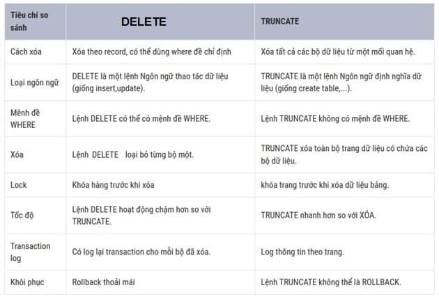

# DDL STATEMENTS

## Learning Goals
- Categorize the main database objects.
- Create a simple table
- Understand how constraints are created at the time of table creation.
- Describe how schema objects work.
- Understand and use to be commands create, alter, drop, truncate table.

## Table of contents
- Introduction to DDL Statements
  - Database
  - Schema
  - Tables
  - Views
  - Stored Procedures
  - Functions
  - Rules
  - Defaults
  - Triggers
- Database Object
  - Scripts editor:
    - Create a database
    - Rename a database
    - Drop a database
  - Graphic tool
    - Create a database
    - Rename a database
    - Drop a database
  - Create database by using a template
- Schema Object
- Table
  - Create table
  - Alter table
    - Add new column
    - Change data type of existing column
    - Delete a column
    - Add or remove constraints
  - Drop table
    - Remove table structure and its data.
- Constraints
  - NOT NULL
  - CHECK
  - UNIQUE
  - PRIMARY KEY
  - FOREIGN KEY
  - DEFAULT
- Truncate

- View
  - Create a view
  - Delete a view